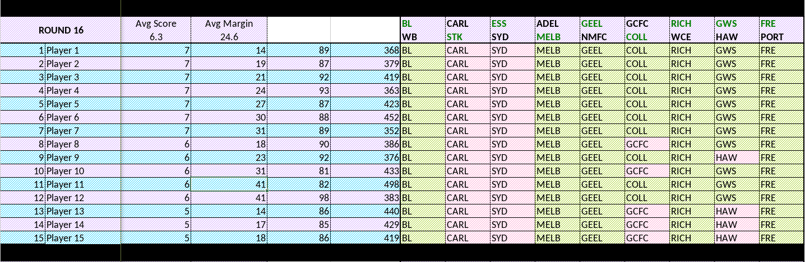

# ESPN Footy Tip Parser/Scraper
A simple Scala / ZIO project that uses selenium to scrape ESPN's footy tipping website to pull results from the website on
slap them in an Excel spreadsheet. 

This is no where near finished. I just needed it for the end of this season. Expect more next season.


## How to run

### Prebuilt Jar
There is currently no customisation built into the project. This leads to a simple command. 
```bash
java -jar footytip-parser-cli-0.1.0.jar "<username>:<password>:<compid>"
```
#### Output
There will be a directory & file created ./dev_cache/scores/[compid].json that contains the raw pulled json.

In the current working directory there will be a [compid].xlsx. This is the generated excel spreadsheet.


### SBT 
Like the prebuilt Jar but ensure that you navigate 
from parent -> cliInterface project.

### Hoping to Implement
- Excel spreadsheet charts of individual performance.
- Webserver that compiles comp results alongside a dashboard like experience for a single players performance. Key stats.

## Example Output

